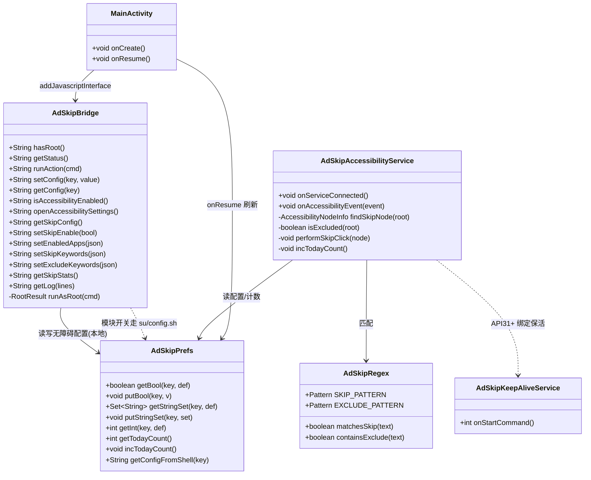
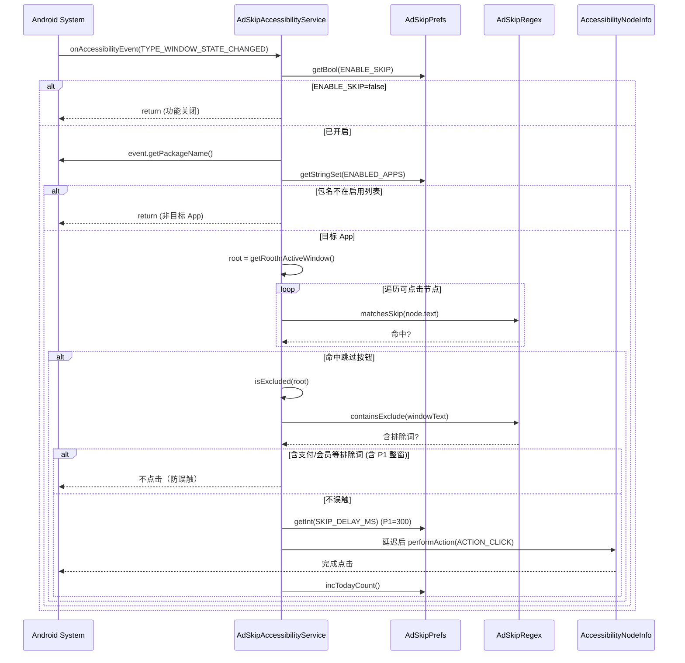
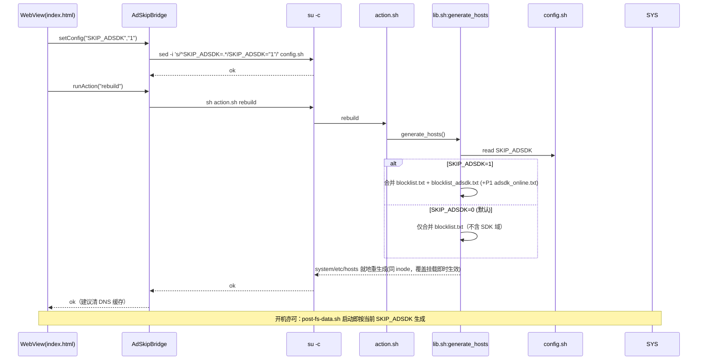
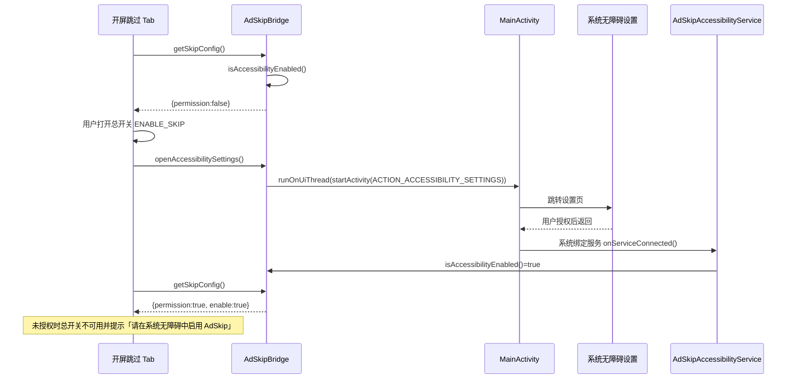

# AdSkip-KSU v1.1 增量架构设计 + 任务分解（去广告增强 · 双管齐下）

> 作者：高见远（software-architect）
> 输入：增量 PRD v1.1 + 现有项目结构（AdSkip-KSU 模块 + AdSkip-App 配套 App）
> 目标：在保留 systemless hosts 去广告基础上，新增 **①广告 SDK 独立域名增强拦截（hosts 线）** 与 **②无障碍开屏广告自动跳过（App 线）**，且 **hosts 增强默认关闭、绝不误伤播放域；无障碍服务默认关闭、需用户授权**。

---

## 一、实现方案 + 框架选型

### 1.1 核心难点

| 难点 | 说明 | 选型 / 对策 |
| --- | --- | --- |
| **hosts 增强必须「默认关闭 + 绝不误伤」** | 若把广告 SDK 域名直接并进 `blocklist.txt`（开机必生效），则无法用开关关闭，且易误杀同名内容/CDN 域 | **独立清单 `common/blocklist_adsdk.txt` + 开关 `SKIP_ADSDK`**：`generate_hosts` 仅在 `SKIP_ADSDK=1` 时合并该清单；`blocklist.txt` 保持 319 条原契约不变 |
| **开关需「rebuild 后生效」** | 改配置后必须重新生成 `/system/etc/hosts` 同一 inode | 复用现有 `action.sh rebuild` → `generate_hosts`；App 侧 `setConfig(SKIP_ADSDK)` 后自动 `runAction("rebuild")` |
| **无障碍命中准确率 + 防误触** | 误点「支付/开通会员」后果严重 | 正则集中管理（`AdSkipRegex`）；命中跳过正则后先做整窗「排除关键词」扫描，命中则不点；P1 再加 300ms 延迟 + 可见可点击约束 |
| **Android 12+ 无障碍后台限制** | 服务可能被系统回收 | `AccessibilityService` 本身由系统常驻绑定（启用即常驻）；P1 在 API≥31 增加 `ForegroundService(specialUse)` 持通知保活 + `BOOT_COMPLETED` 自启 |
| **两线解耦、互不依赖** | hosts 线走 root/config.sh；无障碍线仅 App 本地 SharedPreferences | 完全独立 A/B 开关：`SKIP_ADSDK`（模块变量，root 写回）与 `ENABLE_SKIP`（App SharedPreferences，免 root） |

### 1.2 框架选型

- **零新增第三方依赖**（与现有「纯 Java + su + WebView」一致）：
  - 模块侧：保持 POSIX/busybox shell，不引入 bash 专属语法。
  - App 侧：`AccessibilityService`、`SharedPreferences`、`Pattern` 均为 Android 标准框架，无需 Gradle/第三方库。
  - UI：继续沿用 WebView 加载 `assets/index.html` + 仿 MUI 暗色 CSS（无真实 MUI 库，纯 CSS 还原），新增「开屏跳过」Tab，沿用现有 `data-action` / `render` 联动范式。
- **构建链路不变**：`build.py` 用 `shutil.copytree(src/res/assets)` 自动发现新 Java/资源，新增 `AdSkipAccessibilityService.java`、`res/xml/*` 会被自动编译打包，**构建脚本无需改动**（仅需在 Manifest 声明服务）。

### 1.3 架构模式

- 模块：Magisk 模块风格脚本驱动（`module.prop` + `post-fs-data.sh`/`service.sh`/`action.sh` + `system/` 覆盖挂载），无 OO 模式。
- App：**WebView + JS Bridge（MVC 变体）** —— `MainActivity`(Controller) 注入 `AdSkipBridge`(Model/Bridge)，`index.html`(View)；`AdSkipAccessibilityService` 作为独立 Android 组件，与 Bridge 通过 **共享 `AdSkipPrefs`（SharedPreferences）** 通信。

---

## 二、文件列表（标注 新增 / 修改）

### 模块侧 `AdSkip-KSU/`（hosts 线，无需重打包 APK）

| 路径 | 状态 | 说明 |
| --- | --- | --- |
| `config.sh` | **修改** | 新增 `SKIP_ADSDK="0"`（默认关）；P1 新增 `ADSDK_ONLINE_URL=""`（SDK 域在线子清单源，默认空=不在线更新） |
| `common/blocklist_adsdk.txt` | **新增** | 广告 SDK 独立投放/竞价域名（约 30 条，见 §3.3），仅广告域、不含播放/CDN/内容域 |
| `common/lib.sh` | **修改** | `generate_hosts` 支持条件注入：`SKIP_ADSDK=1` 时合并 `blocklist_adsdk.txt`（+P1 `adsdk_online.txt`）；新增 `fetch_adsdk_online`（P1） |
| `common/adsdk_online.txt` | **新增**（缓存，运行期生成） | P1 SDK 域在线子清单缓存（git 可忽略） |
| `action.sh` | **修改**（轻） | `rebuild` 日志补充提示「已按 SKIP_ADSDK 合并/跳过 adsdk 清单」；`status --json` 不变（开关读取走 App `getConfig`） |
| `module.prop` | **修改** | `version=v1.1.0`、`versionCode=110`、更新 `description` 说明双管齐下 |
| `README.md` | **修改** | 新增「v1.1 去广告增强」章节：说明 `SKIP_ADSDK` 默认关、rebuild 生效、绝不误伤播放域 |
| `docs/ADSDK_REGRESSION.md` | **新增** | 误伤禁用域清单 + 回归口径（见 §8） |

### App 侧 `AdSkip-App/`（无障碍线，需重打包 `AdSkipManager.apk`）

| 路径 | 状态 | 说明 |
| --- | --- | --- |
| `src/com/adskip/app/AdSkipAccessibilityService.java` | **新增** | 无障碍核心服务（监听、命中、排除、延迟、点击、计数） |
| `src/com/adskip/app/AdSkipPrefs.java` | **新增** | SharedPreferences 契约封装（键名/默认值集中管理，服务与 Bridge 共用） |
| `src/com/adskip/app/AdSkipRegex.java` | **新增** | 跳过正则 / 排除正则集中管理（`SKIP_PATTERN`、`EXCLUDE_PATTERN`） |
| `src/com/adskip/app/AdSkipBridge.java` | **修改** | 新增无障碍配置读写 + 模块开关联动接口（见 §3.4）；`CONFIG_KEYS` 增加 `SKIP_ADSDK`；新增 `getConfig(key)` |
| `src/com/adskip/app/MainActivity.java` | **修改** | `onResume` 刷新无障碍权限状态（从设置返回后即时更新 UI）；`openAccessibilitySettings` 走 UI 线程 |
| `AndroidManifest.xml` | **修改** | 声明 `AdSkipAccessibilityService`（含 `BIND_ACCESSIBILITY_SERVICE` 权限 + `<meta-data>` 指向配置）；P1 增加前台保活服务与权限；升 `versionCode/versionName` |
| `res/xml/accessibility_service_config.xml` | **新增** | 服务配置：`eventTypes`、`feedbackType`、`flags`、`settingsActivity`、`description`、`notificationTimeout` |
| `res/values/strings.xml` | **修改** | 新增服务标签/描述、Tab 文案、权限提示等字符串（若文件不存在则新建） |
| `res/drawable/ic_adskip_notify.xml` | **新增** | P1 前台保活通知图标 |
| `assets/index.html` | **修改** | 新增「开屏跳过」Tab（入口与原模块管理并列）：总开关 + 权限徽标、启用 App 列表(多选)、跳过关键词(标签)、防误触白名单(标签)、(P1)今日次数、(P2)仅 WiFi 开关 |

> 说明：`build.py` 自动 `copytree(src/res/assets)`，新增文件无需改构建脚本；最终 APK 落到 `AdSkip-KSU/app/AdSkipManager.apk`，`service.sh` 开机自动 `pm install -r` 覆盖安装。

---

## 三、数据结构与接口

### 3.1 类关系图（Mermaid classDiagram）



### 3.2 SharedPreferences 契约（`AdSkipPrefs`）

> 文件：`adskip_prefs`（MODE_PRIVATE）。服务与 Bridge 共用同一文件，保证两端一致。

| 键名 | 类型 | 默认值 | 说明 |
| --- | --- | --- | --- |
| `ENABLE_SKIP` | boolean | `false` | 无障碍开屏跳过总开关（默认关，需授权） |
| `ENABLED_APPS` | `Set<String>` | `{com.netease.cloudmusic, com.tencent.qqmusic, com.kugou.fan, cn.kuwo.player}` | 启用 App 包名集合（默认 4 大音乐 App） |
| `SKIP_KEYWORDS` | `Set<String>` | `{跳过, 跳过广告, 跳过\\s*\\d+\\s*s?, 关闭, close, ×, X}` | 跳过按钮文案正则片段（拼接为正则） |
| `EXCLUDE_KEYWORDS` | `Set<String>` | `{确认支付, 立即支付, 开通会员, 同意并继续, 领取, 开通}` | 防误触排除关键词（整窗命中则不点） |
| `SKIP_DELAY_MS` | int | `300` | P1 点击前延迟（仅 P1+ 生效，默认 300） |
| `SUBWINDOW_EXCLUDE` | boolean | `true` | P1 整窗含支付/会员关键词时整体排除 |
| `WIFI_ONLY` | boolean | `false` | P2 仅 WiFi 下跳过 |
| `STATS_DATE` | String | 今日 `yyyy-MM-dd` | 今日计数归属日期（跨天自动清零） |
| `STATS_COUNT` | int | `0` | 今日已跳过次数（P1 UI 展示） |

### 3.3 `config.sh` 新增变量（`SKIP_ADSDK` 约定）

```sh
# v1.1：广告 SDK 独立域名增强拦截（hosts 线）
# 默认 0（关闭）：开启后由 action.sh rebuild 重新生成 hosts 时合并 common/blocklist_adsdk.txt。
# 绝不误伤：blocklist_adsdk.txt 仅含纯广告投放/竞价域，不含同名内容域/播放域/音乐 CDN。
SKIP_ADSDK="0"

# P1：SDK 域在线子清单源（空=不在线更新）。启用后 fetch_adsdk_online 拉取到 common/adsdk_online.txt。
ADSDK_ONLINE_URL=""
```

`common/blocklist_adsdk.txt`（节选，每行一个纯域名，与 `blocklist.txt` 同格式）：
```
# ---- 穿山甲 (Pangle) ----
pangle.io
use.pangle.io
c.toutiao.com
# ---- 广点通 (GDT) ----
gdt.qq.com
# ---- 快手 ----
ksads.kuaishou.com
ad.e.kuaishou.com
# ---- 百度 ----
mobads.baidu.com
cpro.baidu.com
# ---- 小米 ----
ad.xiaomi.com
e.ad.xiaomi.com
# ---- 阿里 ----
tanx.com
ad.alimama.com
# ---- InMobi ----
inmobi.com
api.inmobi.com
# ---- Unity ----
unityads.unity3d.com
ads.unity3d.com
# ---- AppLovin ----
applovin.com
api.applovin.com
```

> **约束（硬）**：以上均为广告投放/竞价域；**禁止**出现 `music.163.com`、`y.qq.com`、`*.music.qq.com`、各音乐 App 的播放/下载/图片 CDN 等。误伤豁免机制见 §8。

### 3.4 WebView JS↔Native 通信协议扩展（`AdSkipBridge` 新增接口）

> 既有 `runAction`(白名单)/`setConfig`(白名单键+值正则) 不变。模块侧开关走 `su`（与既有一致）；无障碍侧配置走本地 SharedPreferences（免 root）。

| 方法 | 参数 | 返回 | 类别 | 说明 |
| --- | --- | --- | --- | --- |
| `getConfig(key)` | `key`（白名单：`SKIP_ADSDK` 等） | `{"value":"0"}` / `{"error":"bad_cmd"}` | 模块(root) | 读 `config.sh` 变量值（供 UI 显示 hosts 开关状态） |
| `isAccessibilityEnabled()` | — | `"true"`/`"false"` | 无障碍(本地) | 检测本服务是否在系统无障碍已启用 |
| `openAccessibilitySettings()` | — | `"ok"` | 无障碍(本地) | UI 线程跳转 `ACTION_ACCESSIBILITY_SETTINGS` |
| `getSkipConfig()` | — | JSON（见下） | 无障碍(本地) | 一次性返回全部无障碍配置 + 权限状态 |
| `setSkipEnable(bool)` | `"true"`/`"false"` | `{"ok":true}` | 无障碍(本地) | 写 `ENABLE_SKIP` |
| `setEnabledApps(json)` | `["pkg",...]` | `{"ok":true}` | 无障碍(本地) | 覆盖写 `ENABLED_APPS` |
| `setSkipKeywords(json)` | `["跳过",...]` | `{"ok":true}` | 无障碍(本地) | 覆盖写 `SKIP_KEYWORDS`（P1 可编辑） |
| `setExcludeKeywords(json)` | `["确认支付",...]` | `{"ok":true}` | 无障碍(本地) | 覆盖写 `EXCLUDE_KEYWORDS`（P1 可编辑） |
| `getSkipStats()` | — | `{"date":"...","count":0}` | 无障碍(本地) | 今日跳过次数（P1 UI 展示） |

`getSkipConfig()` 返回示例：
```json
{
  "permission": false,
  "enable": false,
  "enabledApps": ["com.netease.cloudmusic","com.tencent.qqmusic","com.kugou.fan","cn.kuwo.player"],
  "enabledAppCount": 4,
  "skipKeywords": ["跳过","跳过广告","跳过\\s*\\d+\\s*s?","关闭","close","×","X"],
  "excludeKeywords": ["确认支付","立即支付","开通会员","同意并继续","领取","开通"],
  "wifiOnly": false,
  "skipDelayMs": 300,
  "subwindowExclude": true,
  "todayCount": 0
}
```

> **安全**：无障碍侧方法不经 `su`、无命令执行；仅读写本地 SharedPreferences，无法越权。模块侧 `getConfig`/`setConfig` 仍受白名单 + 值正则 `^[A-Za-z0-9._:-]+$` 约束（值 `"0"`/`"1"` 合法）。

### 3.5 `AdSkipAccessibilityService` 关键方法签名

```java
public class AdSkipAccessibilityService extends AccessibilityService {
    @Override public void onServiceConnected();           // 注册、读配置
    @Override public void onAccessibilityEvent(AccessibilityEvent e); // 入口
    private AccessibilityNodeInfo findSkipNode(AccessibilityNodeInfo root); // 遍历可点击节点，AdSkipRegex.matchesSkip
    private boolean isExcluded(AccessibilityNodeInfo root); // AdSkipRegex.containsExclude + P1 整窗支付/会员关键词
    private void performSkipClick(AccessibilityNodeInfo node); // P1 延迟+可见可点击后 performAction(ACTION_CLICK)
    private void incTodayCount();                          // AdSkipPrefs 跨天清零+自增
}
```

### 3.6 `res/xml/accessibility_service_config.xml`（关键字段）

```xml
<accessibility-service xmlns:android="http://schemas.android.com/apk/res/android"
    android:description="@string/acc_service_desc"
    android:packageNames="com.netease.cloudmusic:com.tencent.qqmusic:com.kugou.fan:cn.kuwo.player"
    android:accessibilityEventTypes="typeWindowStateChanged|typeWindowContentChanged"
    android:accessibilityFeedbackType="feedbackGeneric"
    android:notificationTimeout="100"
    android:canRetrieveWindowContent="true"
    android:settingsActivity="com.adskip.app.MainActivity"
    android:flags="flagReportViewIds|flagRetrieveInteractiveWindows" />
```

> 注：`packageNames` 仅作提示；**真正的包名过滤以 `AdSkipPrefs.ENABLED_APPS` 运行时为准**（支持 App 内增删），清单此处填默认值便于系统分类。

---

## 四、程序调用流程（Mermaid sequenceDiagram）

### 4.1 无障碍：命中 → 排除 → 延迟 → 点击



### 4.2 hosts 增强：开关 → rebuild 生效



### 4.3 权限引导流程



---

## 五、任务列表（有序、含依赖；hosts 线 T1–T3 与 App 线 T5–T10 并行）

> 两条线相互独立，可并行开发；T10 为收口（重打包 + 集成自测），依赖两条线完成。

### hosts 线（模块侧，不改 APK）

| 任务 | 名称 | 源文件 | 依赖 | 优先级 |
| --- | --- | --- | --- | --- |
| **T1** | 模块配置 + SDK 域名清单 + 版本 | `config.sh`(改)、`common/blocklist_adsdk.txt`(新)、`module.prop`(改) | 无 | P0 |
| **T2** | 条件生成 + (P1) 在线子清单 | `common/lib.sh`(改)、`common/adsdk_online.txt`(新/缓存)、`action.sh`(改) | T1 | P0/P1 |
| **T3** | 模块侧文档 + 回归口径 | `README.md`(改)、`docs/ADSDK_REGRESSION.md`(新)、`system/etc/hosts`(确认占位) | T1,T2 | P0 |

### App 线（无障碍侧，需重打包 APK）

| 任务 | 名称 | 源文件 | 依赖 | 优先级 |
| --- | --- | --- | --- | --- |
| **T5** | 无障碍服务骨架 + Manifest + 资源配置 | `AdSkipAccessibilityService.java`(新)、`AndroidManifest.xml`(改)、`res/xml/accessibility_service_config.xml`(新)、`res/values/strings.xml`(改) | 无（与 T1 并行） | P0 |
| **T6** | 服务核心逻辑（命中/排除/延迟/点击/计数） | `AdSkipAccessibilityService.java`(逻辑)、`AdSkipPrefs.java`(新)、`AdSkipRegex.java`(新) | T5 | P0/P1 |
| **T7** | 桥扩展（无障碍配置读写 + 模块开关联动） | `AdSkipBridge.java`(改)、`MainActivity.java`(改)、`AdSkipPrefs.java`(用) | T5,T6 | P0/P1 |
| **T8** | WebView「开屏跳过」Tab | `assets/index.html`(改) | T7 | P0/P1 |
| **T9** | 保活 + P2 增强 | `AdSkipKeepAliveService.java`(新,P1)、`res/drawable/ic_adskip_notify.xml`(新,P1)、`AdSkipAccessibilityService.java`(WIFI_ONLY/P2)、`AndroidManifest.xml`(P1/P2) | T6 | P1/P2 |
| **T10** | 打包与集成自测 | `AdSkipManager.apk`(重打包)、`build.py`(确认自动包含)、自测清单 | T1–T9 | P0 |

### 依赖关系图（Mermaid graph）

```mermaid
graph TD
    T1[T1 模块配置+清单+版本] --> T2[T2 条件生成+在线子清单]
    T2 --> T3[T3 文档+回归口径]
    T1 -.并行. T5[T5 无障碍骨架+Manifest]
    T5 --> T6[T6 服务核心逻辑]
    T6 --> T7[T7 桥扩展+开关联动]
    T6 --> T9[T9 保活+P2增强]
    T7 --> T8[T8 开屏跳过 Tab]
    T1 --> T10[T10 打包+集成自测]
    T3 --> T10
    T8 --> T10
    T9 --> T10
```

---

## 六、依赖与约束

1. **权限（AndroidManifest）**
   - `android.permission.BIND_ACCESSIBILITY_SERVICE`（`<service>` 声明必备，系统强制）。
   - 普通 `<uses-permission android:name="android.permission.BIND_ACCESSIBILITY_SERVICE" />`。
   - P1 前台保活：`FOREGROUND_SERVICE` + `FOREGROUND_SERVICE_SPECIAL_USE`（API≥31），`foregroundServiceType="specialUse"`。
   - **不新增 `INTERNET`**：无障碍线纯本地，保持 App「无网络权限」契约（符合既有安全设计）。
2. **Android 12+（`targetSdk=34`）后台限制**：`AccessibilityService` 启用后由系统常驻绑定；P1 额外 `AdSkipKeepAliveService` 前台持通知保活 + 监听 `BOOT_COMPLETED` / `MY_PACKAGE_REPLACED` 自启。
3. **默认关闭（硬约束）**
   - `SKIP_ADSDK="0"`（config.sh）→ 默认不把任何 SDK 域写入 hosts。
   - `ENABLE_SKIP=false`（SharedPreferences）→ 无障碍总开关默认关，且未授权时 UI 禁用并提示。
4. **防误触正则（集中管理）**
   - 跳过：`^(\s*跳过\s*|\s*跳过广告\s*|\s*跳过\s*\d+\s*s?\s*|\s*关闭\s*|\s*close\s*|\s*×\s*|\s*X\s*)$`（锚定，避免误匹配「关闭会员」）。
   - 排除：`确认支付|立即支付|开通会员|同意并继续|领取|开通`（整窗子串匹配，命中则不点）。
5. **绝不误伤播放域**：`blocklist_adsdk.txt` 仅广告投放/竞价域；同名内容/播放/CDN 域一律不入；提供 `docs/ADSDK_REGRESSION.md` 回归口径（见 §8）。
6. **构建约束**：新增 `.java`/`res/xml` 由 `build.py` 自动发现；仅需在 `AndroidManifest.xml` 声明服务，无需改 `build.py`/`assemble.py`。`javac` 以 `android-34.jar` 为 classpath，API 使用须 ≥ `minSdk=23`。

---

## 七、共享知识（跨文件命名 / 契约）

- **开关解耦契约**：`SKIP_ADSDK`（模块变量，root 写回 + `rebuild`）↔ `ENABLE_SKIP`（App SharedPreferences，免 root）。UI 上并列展示，互不影响。
- **正则集中管理**：所有跳过/排除正则只在 `AdSkipRegex.java` 定义，服务与（未来）测试共用，禁止在业务代码内联硬编码。
- **SharedPreferences 键名集中**：所有键名只在 `AdSkipPrefs.java` 以常量定义，服务与 Bridge 共用，避免拼写漂移。
- **白名单防误触**：跳过正则锚定匹配按钮文案；排除正则整窗扫描。二者任一命中即不点击。
- **值与命令白名单**：`AdSkipBridge` 的 `runAction`/`setConfig`/`getConfig` 保持白名单 + 值正则 `^[A-Za-z0-9._:-]+$`，杜绝注入。
- **清单格式统一**：`blocklist_adsdk.txt` 与 `blocklist.txt` 同格式（每行纯域名、`#` 注释、空行忽略），`generate_hosts` 复用既有逐行逻辑，双栈黑洞地址一致。
- **状态读取约定**：hosts 开关状态经 `getConfig("SKIP_ADSDK")`；无障碍状态经 `getSkipConfig()`。UI 渲染沿用既有 `render(s)` 范式扩展。

---

## 八、待明确事项（架构侧建议值）

| # | PRD 待确认 | 架构建议值 | 理由 |
| --- | --- | --- | --- |
| 1 | 默认开关值 | `SKIP_ADSDK=0`（hosts 线默认关）；`ENABLE_SKIP=false`（无障碍线默认关） | 遵循「默认不误伤 + 最小惊讶」，用户确认「双管齐下」仍需主动开启；与「绝不误伤播放域」硬约束一致 |
| 2 | 误伤禁用域清单 + 回归口径 | 见 `docs/ADSDK_REGRESSION.md`。禁用域＝任何音乐 App 的 **播放/下载/搜索/图片 CDN/同名内容域**；回归口径：①`SKIP_ADSDK=0` 时 `hosts` 不含任何 adsdk 域；②开启后仅**增量**新增 adsdk 域；③真机回归 4 大音乐 App 播放/下载/搜索正常；④误伤豁免＝从 `blocklist_adsdk.txt` 移除该域或 `SKIP_ADSDK=0` | 以「域用途」而非「域名关键词」判定，避免误杀同名内容域 |
| 3 | Android 12+ 保活 | P1：`AdSkipKeepAliveService`（前台 specialUse + 常驻通知）+ `BOOT_COMPLETED`/`MY_PACKAGE_REPLACED` 自启；默认**不强制**前台服务（避免打扰），仅在 API≥31 且用户开启时启用 | 服务本身常驻；前台服务仅兜底保活，且需用户知情（通知） |
| 4 | 启用列表为空行为 | 列表为空 ⇒ 服务对所有 App **不生效**（等同关闭），UI 提示「启用列表为空，跳过功能对所有应用关闭」；**不做全局兜底**（避免误触其他 App） | 显式空态优于隐式全局生效，符合「最小权限/最小误触」 |
| 5 | hosts 与无障碍是否独立 A/B 开关 | **是，完全独立**。两条线互不依赖、可单独开启/关闭；UI 并列（模块管理页含 hosts 开关；开屏跳过页含无障碍开关） | 解耦降低风险，任一线异常不影响另一线 |

> 补充建议：PRD「在 `blocklist.txt` 增补」与「新增 `blocklist_adsdk.txt` 约定」存在张力 —— **架构裁定：`blocklist.txt` 保持 319 条原契约不变**，广告 SDK 域名独立落到 `blocklist_adsdk.txt` 并由 `SKIP_ADSDK` 门控。否则无法满足「默认关闭」与「绝不误伤」（进 `blocklist.txt` 即开机必生效）。此裁定是满足硬约束的唯一可行方案。

---

*文档结束。下一步：team-lead 评审建议值后，Engineer 按 T1–T10 并行推进，T10 收口重打包 `AdSkipManager.apk`。*
