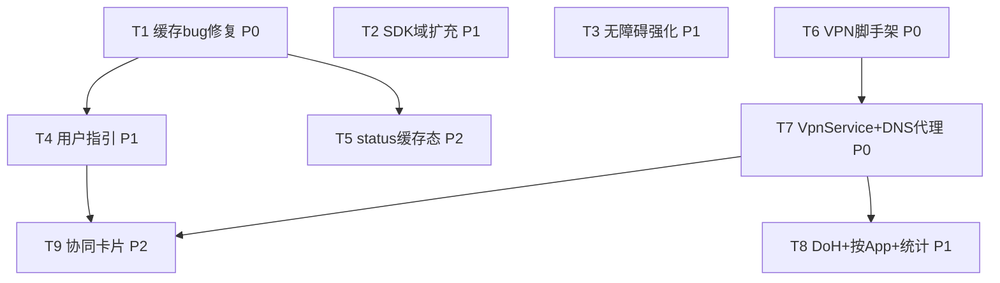

# AdSkip-KSU v1.2 架构设计 + 任务分解（缓存修复 · SDK 域扩充 · 无障碍强化 · VPN 新应用）

> 作者：高见远（software-architect-2）
> 输入：v1.2 增量 PRD（要点见 team-lead 任务指派）+ 现有代码实测诊断（config.sh / lib.sh / action.sh / AdSkip App 源码）
> 目标：在 v1.1 已发布（GitHub ydlyang123456/AdSkip-KSU · Release v1.1.0）基础上做 **v1.2 增量开发**：
> **Phase 1** 修复模块三项缺陷（缓存 bug / 默认全关 / hosts 规模护栏）+ 扩充广告 SDK 域 + 强化无障碍跳过 + 用户指引；
> **Phase 2** 立项独立 VPN 应用（`com.adskip.vpn`，需 INTERNET，与无 INTERNET 的 manager App 完全分离）。
> 本次产出为**设计 + 分解**，不写实现代码（实现交后续工程师）。

---

## 〇、硬约束（贯穿全程，任何方案不得突破）

1. **默认全关**：`ONLINE_UPDATE=false`、`SKIP_ADSDK=0`、VPN 应用独立 **opt-in**（默认不启用）。
2. **绝不误伤音乐播放域 / 内容域 / 音乐 CDN**：所有新增 hosts 域名（含 VPN 黑名单）必须对照 `docs/ADSDK_REGRESSION.md` 红线——**只收广告/SDK 服务端域**，严禁音乐 App 播放流、下载、搜索、图片 CDN、同名内容/主站域。
3. **manager App 无 INTERNET**：`AdSkip-App/AndroidManifest.xml` 不声明任何网络权限；所有网络行为仍由模块脚本在 root 侧执行。
4. **VPN 与 manager App 完全分离、不合并**：合并会破坏 manager App「无 INTERNET」安全模型。VPN 独立 APK、独立工程目录（`E:/root模块/AdSkipVPN/`），MVP 不要求 root。

---

## 一、实现方案 + 框架选型

### 1.1 核心难点与对策

| 难点 | 根因（实测） | 对策 |
| --- | --- | --- |
| **卡顿根因** | `config.sh:13 ONLINE_UPDATE="true"`，5 个激进源合并 `downloaded_hosts.txt` 达 2,653,393 条；`lib.sh:88-91` **无条件** `tr -d '\r' < "$_dl" >> "$_out"` 把 265 万条追加进 `/etc/hosts` → DNS 拖死 | **双重门控**：仅当 `ONLINE_UPDATE="true"` 且缓存为「在线态」(`.dl_online` 标记存在) 才追加；默认 `ONLINE_UPDATE=false` |
| **Bug：关在线更新仍卡** | `generate_hosts` 追加在线缓存**无条件**——`ONLINE_UPDATE=false` 只停下载，旧缓存仍写进 hosts（关在线更新≠不卡） | `generate_hosts` 追加逻辑加 `ONLINE_UPDATE` 判定；新增 `action.sh clearcache` 截断缓存 + rebuild |
| **hosts 规模无护栏** | 生成后不去衡量行数，超大列表无告警 | 生成后去重行数超阈值（默认 5 万，`HOSTS_GUARD_LINES`）记 **warn** 并提示 |
| **SDK 域覆盖不足** | `blocklist_adsdk.txt` 仅 ~60 条国际/主流联盟 | P1 按分类扩充中国广告联盟/预加载域（穿山甲扩展、优量汇、华为/荣耀、OPPO/vivo、快手磁力、360、多盟、AdView、有米、个推、极光、头条广告域等），**逐条对照红线** |
| **无障碍命中率/覆盖** | 仅基础「跳过」正则；无倒计时/滑动/遮罩识别 | P1 扩展正则（倒计时 `跳过(5)`）、安全关闭词、滑动关闭（默认关）、全屏广告遮罩识别；**保留并扩展安全白名单** |
| **VPN 新应用（重点）** | 需接管设备 DNS、过滤广告域名、屏蔽 DoH、与真实 VPN 单槽位共存 | fake-VPN（DNS-only 分流隧道）+ 本地 DNS 代理 + 黑名单过滤 + DoH 端点域名阻断；独立工程、独立 APK |

### 1.2 框架选型

- **模块侧**：保持 **POSIX / busybox shell**，不引入 bash 专属语法（与现有 `config.sh`/`lib.sh`/`action.sh` 一致）。零依赖。
- **manager App 侧**：保持 **纯 Java + `su` + WebView**，零外部库 / Gradle 依赖（与现有 `AdSkip-App` 一致）。新增逻辑沿用 `AdSkipRegex`/`AdSkipPrefs` 集中管理范式。
- **VPN 应用侧**：**纯 Android SDK + Java，零第三方库**（不引入 dnsjava 等，DNS 报文最小解析自实现，保持与团队「零依赖」一致）。`VpnService` 为系统标准组件，无需额外库。构建沿用 `AdSkip-App` 的 `build.py` 风格（javac + `android-34.jar` + aapt + apksigner / `debug.keystore`），不引入 Gradle，降低工具链负担。
- **构建链路**：`build.py` 自动 `copytree(src/res/assets)`，新增 `.java`/`res` 自动发现，仅需在 `AndroidManifest.xml` 声明服务/权限，无需改构建脚本。

### 1.3 架构模式

- 模块：Magisk 模块风格脚本驱动（无 OO），本次核心是 **缓存态标记文件 `.dl_online`** 与 **`generate_hosts` 双重门控**。
- manager App：WebView + JS Bridge（MVC 变体）；新增「缓存态查询/清缓存」桥方法，复用既有 `runAction` 白名单。
- VPN App：`VpnService`（ foreground ）+ **本地 DNS 代理线程模型**：`AdSkipVpnService` 建 tun → `VpnTunnel` 读包 → `DnsProxy` 查黑名单/转发 → `DnsResolver`（`protect()` 上游）→ 回写。数据层 `Blocklist` / `BlockStats` / `AppPolicy` / `Prefs` 全本地。

---

## 二、缓存 Bug 修复的精确方案（P0 · 核心）

### 2.1 门控模型（裁定：Model B — 双重门控）

> 设计要点 1 的精确方案。

**核心思想**：用标记文件 `common/.dl_online` 区分「在线态缓存」与「离线态/陈旧缓存」；`generate_hosts` 追加 `downloaded_hosts.txt` **必须同时满足**：

```
APPEND ⇔ ( ONLINE_UPDATE == "true" )  AND  ( -f common/.dl_online )  AND  ( -s common/downloaded_hosts.txt )
```

- 当 `ONLINE_UPDATE=false`（默认）→ **不追加**（旧的大体积缓存不再写进 hosts，卡顿修复）。
- 当 `ONLINE_UPDATE=true` 但缓存非「在线态」（无 `.dl_online`，如 `clearcache` 后/拉取失败）→ **不追加**。
- 仅当「在线更新开启」且「缓存为本次在线拉取成功态」才追加。

### 2.2 各函数协同（设计级伪代码，供工程师实现）

**`common/lib.sh` — `fetch_online`（成功分支末尾新增标记）：**
```sh
# 归一化写入 downloaded_hosts.txt 成功后：
: > "$MODDIR/common/.dl_online"      # 标记缓存为「在线态」
log_msg "info" "online update complete (marked .dl_online)"
return 0
# 失败分支：删除标记（保留旧 downloaded_hosts.txt 但使其「非在线态」，不被追加）
rm -f "$MODDIR/common/.dl_online"
```

**`common/lib.sh` — `generate_hosts`（替换原 88-91 行）：**
```sh
# 仅当「在线更新开启」且「缓存为在线态」才追加下载缓存；否则跳过（修复关更新仍卡）
if [ "$ONLINE_UPDATE" = "true" ] && [ -f "$MODDIR/common/.dl_online" ] && [ -s "$_dl" ]; then
    tr -d '\r' < "$_dl" >> "$_out"
    log_msg "info" "generate_hosts: appended online cache (ONLINE_UPDATE=true, online-state)"
else
    log_msg "info" "generate_hosts: online cache NOT appended (ONLINE_UPDATE=$ONLINE_UPDATE, marker=$( [ -f "$MODDIR/common/.dl_online" ] && echo yes || echo no ))"
fi
```

**`config.sh` — 默认翻转 + 护栏阈值：**
```sh
ONLINE_UPDATE="false"                       # v1.2 默认关（修复卡顿根因）
HOSTS_GUARD_LINES=50000                     # v1.2 新增：生成后去重行数超此阈值记 warn
```

**`common/lib.sh` — `generate_hosts` 末尾增加护栏（去重写回后）：**
```sh
# 护栏：统计去重后有效行数（跳过 # 注释与空行）
_n=$(grep -cvE '^[[:space:]]*#|^[[:space:]]*$' "$_out" 2>/dev/null)
if [ -n "$_n" ] && [ "$_n" -gt "$HOSTS_GUARD_LINES" ]; then
    log_msg "warn" "hosts line count $_n exceeds safe threshold $HOSTS_GUARD_LINES; 建议关闭 ONLINE_UPDATE 或执行 clearcache 以恢复 DNS 性能"
fi
```

### 2.3 `clearcache` 子命令语义（新增）

> `action.sh` 新增 `clearcache`：`截断 downloaded_hosts.txt` + `删 .dl_online` + `删 .last_update` + `generate_hosts`（rebuild 离线态）。

```sh
clearcache)
    : > "$MODDIR/common/downloaded_hosts.txt"     # 截断在线缓存（保留空文件，避免 _emit 判断）
    rm -f "$MODDIR/common/.dl_online"             # 清除在线态标记
    rm -f "$MODDIR/common/.last_update"           # 允许下次 update 重新拉取
    generate_hosts                                # 重新生成（此时无缓存可追加 → hosts 仅内置+adsdk）
    _t=$(grep -cvE '^[[:space:]]*#' "$MODDIR/system/etc/hosts" 2>/dev/null)
    log_msg "info" "clearcache done; hosts regenerated: ${_t:-0} 条（已移除在线缓存）"
    echo "已清除在线缓存并重新生成 hosts（${_t:-0} 条）。建议重启或清除 DNS 缓存。"
    ;;
```

### 2.4 升级迁移与 App 黄条检测

- v1.1 设备已有 `ONLINE_UPDATE=true` + 265 万条缓存。v1.2 刷入后 `ONLINE_UPDATE` 默认 `false` → 首次 `post-fs-data.sh` 启动 `generate_hosts` 见 `ONLINE_UPDATE=false` → **不再追加缓存** → hosts 回落到内置清单，卡顿消失。
- 旧缓存文件 `downloaded_hosts.txt` 残留在磁盘（无害、不被使用）。App 检测「陈旧缓存」：`downloaded_hosts.txt` 非空 **且**（`ONLINE_UPDATE!=true` 或 无 `.dl_online`）→ `staleCache=true` → 首页/模块页黄条提示「检测到旧缓存（N 条）仍在，可能影响 DNS 速度，点此清除」+ 一键 `clearcache`。

---

## 三、`blocklist_adsdk` 扩充（P1）

> 设计要点 2。所有候选域**逐条对照 `docs/ADSDK_REGRESSION.md` 红线**：仅广告投放/竞价 SDK 服务端域；**禁止**音乐 App 播放/下载/搜索/图片 CDN、同名内容/主站域、账号/支付/社交域。

### 3.1 建议新增域名的分类清单（在现有 ~60 条基础上扩充）

> 标注中「✅ 红线判定」说明为何只收广告域。「⚠️ 谨慎」= 推送/归因类，按红线 §一须确认用于广告归因且不影响播放；默认纳入但列明风险，回归失败即移除。

| 分类 | 建议新增域名 | 红线判定 |
| --- | --- | --- |
| **穿山甲扩展域** | `log.pangle.io`、`agent.pangle.io` | ✅ Pangle 广告 SDK 日志/代理服务域（非内容） |
| **腾讯优量汇 (Ylh)** | `ylh.qq.com` | ✅ 优量汇广告交易域（与 `gdt.qq.com` 并列，非 `y.qq.com` 音乐内容域） |
| **华为/荣耀广告** | `ads.huawei.com` | ✅ 华为广告 SDK 服务端域（非 `cloud.huawei.com`/`music.huawei.com`） |
| **OPPO 广告** | `ads.coloros.com` | ✅ ColorOS 广告 SDK 域（非 `store.oppo.com` 内容） |
| **vivo 广告** | `ads.vivo.com` | ✅ vivo 广告 SDK 域 |
| **快手磁力引擎** | `ad.kuaishou.com` | ✅ 快手广告服务端域（与既有 `ad.e.kuaishou.com`/`ksads.kuaishou.com` 并列，非 `live.kuaishou.com` 播放域） |
| **360 广告** | `ad.360.cn`、`ads.360.cn` | ✅ 360 移动广告域 |
| **多盟 (Domob)** | `domob.cn`、`s.domob.cn` | ✅ 多盟广告 SDK 域 |
| **AdView** | `adview.cn`、`a.adview.cn` | ✅ AdView 广告 SDK 域 |
| **有米 (Youmi)** | `ad.youmi.net`、`youmi.net` | ✅ 有米广告 SDK 域 |
| **极光联盟 (JG Ad)** | `ad.jiguang.cn` | ✅ 极光广告联盟域（与推送 `jpush.cn` 区分，仅收 `ad.` 前缀） |
| **个推（归因）** | `getui.com`、`sdk.getui.com` | ⚠️ 谨慎：推送/归因 SDK；仅当其用于广告归因时纳入，真机回归若影响播放/推送功能则移除；建议**默认不纳入**，提供「仅广告归因域」开关 |
| **今日头条广告域** | （已由 `ad.toutiao.com`/`c.toutiao.com` 覆盖，无需新增） | — |
| **国际补充（纯广告）** | `googleads.g.doubleclick.net`、`pagead2.googlesyndication.com`、`adservice.google.com`、`admob.com`、`criteo.com`、`pubmatic.com` | ✅ 全球广告交易/投放域（非 Google 内容域如 `youtube.com`） |

### 3.2 合并回归测试口径

1. **默认关验证**：`SKIP_ADSDK=0`（默认）时 `rebuild` 后 `system/etc/hosts` **不含** 任何 `blocklist_adsdk.txt` 中的域（grep 校验）。
2. **增量验证**：`SKIP_ADSDK=1` 后 `rebuild`，hosts 仅在 319 条基础上**增量**新增 adsdk 域，不删/不改既有条目。
3. **红线逐条核查**：PR 合并前对每条新增域执行 `grep -E`（对照 `ADSDK_REGRESSION.md` 禁用域清单：任何 `music.163.com`/`y.qq.com`/`*.kugou.com` 内容域/`*.kuwo.cn`/`*.qbox.me` 等 CDN）→ **零命中**。
4. **真机播放回归**：4 大音乐 App（网易云/QQ音乐/酷狗概念版/酷我）播放/下载/搜索/歌词封面正常（沿用 v1.1 口径）。
5. **⚠️ 谨慎域处置**：`getui.com`/`jpush.cn` 等推送归因域，先在**隔离开关**下验证不影响音乐 App 推送/播放；任一异常即从清单移除（保持「删域即豁免」机制）。
6. **误伤豁免**：某 App 因 adsdk 域误伤 → 从 `blocklist_adsdk.txt` 移除该域，或 `SKIP_ADSDK=0`。

---

## 四、无障碍强化设计（P1）

> 设计要点 3。在 v1.1 `AdSkipAccessibilityService`（包名过滤 + 跳过正则 + 整窗排除 + 防误触白名单）流程上**扩展**，不推翻。

### 4.1 节点识别算法（AccessibilityNodeInfo 遍历策略）

沿用现有 `findSkipNode`（BFS 遍历可点击节点，匹配 `AdSkipRegex.matchesSkip`）；新增三类命中：

1. **倒计时跳过按钮**：扩展 `SKIP_KEYWORDS` 正则片段，覆盖 `跳过(5)`、`跳过(5s)`、`跳过 5s` 等：
   - 新增片段：`跳过\s*\(\d+\)`、`跳过\s*\(\d+\s*s?\)`、`跳过广告\s*\d+\s*s?`
   - 现有 `跳过\s*\d+\s*s?` 已覆盖「跳过 5s」。
2. **全屏广告遮罩层识别**：新增 `findCloseNode(root)`——优先在「近似全屏容器」（bounds 覆盖屏幕 ≥90%）内，寻找含「关闭/×/X/跳过」文本或 `contentDescription` 的可点击子节点；命中后经整窗排除扫描再点击。识别「广告」标记节点（`text` 含「广告」二字）作为遮罩证据，但**点击目标仍是关闭按钮，绝不点击广告本体**。
3. **滑动关闭（默认关）**：新增 `ENABLE_SLIDE_CLOSE`（默认 `false`）。当节点文本命中「上滑关闭/滑动跳过广告/滑动关闭」等提示且 `ENABLE_SLIDE_CLOSE=true` 时，经 `dispatchGesture`（API≥24，`canPerformGestures` 权限）在屏幕中部执行一段上滑/横滑手势关闭广告。默认关以避免误触；开启需用户在设置中授予手势权限。

### 4.2 与现有流程衔接

```
onAccessibilityEvent
 ├─ ENABLE_SKIP? 否 → return
 ├─ 包名 ∈ ENABLED_APPS? 否 → return
 ├─ WIFI_ONLY? 否 → return
 ├─ 取根 → findSkipNode(倒计时/跳过正则) ∪ findCloseNode(遮罩关闭按钮)
 │    命中候选节点 →
 ├─ scanExclude(整窗排除词扫描) 命中? → 不点（防误触，白名单保底）
 ├─ 否则：
 │    候选为「点击型」→ 延迟+可见可点击 → performAction(ACTION_CLICK) → incTodayCount
 │    候选为「滑动型」(ENABLE_SLIDE_CLOSE) → dispatchGesture 滑动
 └─ 回收节点（沿用现有回收契约）
```

### 4.3 安全白名单（不可删，且扩展）

- **保留**既有 `EXCLUDE_KEYWORDS`：`确认支付`、`立即支付`、`开通会员`、`同意并继续`、`领取`、`开通`。
- **扩展排除词（防误触，绝不点）**：新增 `了解详情`、`立即体验`（业务转化按钮，绝不自动点）。
- **新增安全点击候选（纯关闭/无副作用）**：`知道了`、`稍后`（常见弹窗关闭按钮，受整窗排除保护）。
- **架构裁定（待确认 Q4）**：`领取/开通/了解详情/立即体验` **仅加入排除词（绝不点），不加入点击候选**；仅 `知道了/稍后` 作为安全点击候选。倒计时正则加入点击候选。理由：安全 > 覆盖，避免误领红包/误开会员。

---

## 五、VPN 应用架构（Phase 2 · 重点）

> 设计要点 4。`com.adskip.vpn`，独立工程 `E:/root模块/AdSkipVPN/`，独立 APK，`AndroidManifest.xml` 声明 `INTERNET`，与 manager App 完全分离、不合并。

### 5.1 VpnService 如何接管设备 DNS（fake-VPN / DNS-only 分流隧道）

采用 **DNS-only 分流隧道**（最稳健、设备保持全功能联网，无需转发普通流量）：

1. `AdSkipVpnService.Builder` 配置：
   - `addAddress("10.0.0.1", 32)` —— 本地 tun 虚拟地址。
   - `addRoute("10.0.0.1", 32)` —— **仅把 DNS 服务器 IP 路由进 tun**（分流，不捕获 0.0.0.0/0）。
   - `addDnsServer("10.0.0.1")` —— 系统解析器把 DNS 查询发往 tun。
   - `addDisallowedApplication(pkg)`（对每个「放行 App」）—— 这些 App 完全绕过 VPN，用真实 DNS。
2. 系统把 DNS 查询（UDP→10.0.0.1:53）写入 tun fd；`VpnTunnel` 读 `FileInputStream`，解析 IPv4+UDP 头，取出 DNS payload。
3. `DnsProxy` 解析查询域名 → 查 `Blocklist`：
   - **命中黑名单** → 伪造响应（A=0.0.0.0 / NXDOMAIN）写回 tun。
   - **未命中** → `DnsResolver` 经 `VpnService.protect(socket)` 排除自身后，转发到受控上游明文 DNS（如 `223.5.5.5`/`119.29.29.29`），读回响应写回 tun。
4. 仅 DNS 走 tun；其余流量走真实网络 → 设备正常上网，仅 DNS 被过滤。

> 备选（非 MVP）：`addRoute("0.0.0.0",0)` 全捕获 + 自实现 TCP/UDP 转发器（AdGuard 模式）。复杂度高，MVP 不采用。

### 5.2 域名黑名单过滤的数据来源

- **离线内置**：`assets/blocklist.txt`（随 APK 打包，仅广告/追踪域，绝不播放域；复用 AdSkip 域语义的子集）。
- **可选复用模块 blocklist（root opt-in）**：提供「从 AdSkip 模块导入」入口（deep-link 到 manager App 或直接 root 读取 `/data/adb/modules/adskip_ksu/common/blocklist.txt`+`blocklist_adsdk.txt`），需用户授权 root。MVP 不强制；离线内置即生效。

### 5.3 DoH 端点屏蔽机制（无需 TLS MITM）

- `DohBlocklist` 维护已知 DoH 端点域名：`dns.google`、`dns.cloudflare.com`、`dns.quad9.net`、`dns.alidns.com`、`doh.opendns.com`、`doh.pub`、`rubyfish.cn` 等。
- 机制：**DoH 端点域名本身在 DNS 层被阻断**——当某 App 欲建 DoH 连接，先对其 DoH 端点做 DNS 解析；我们对其返回 `0.0.0.0`/NXDOMAIN → App 无法连上 DoH → **回退到系统明文 DNS（即被我们过滤的 tun DNS）**。
- 无需解密 HTTPS/TLS，仅把 DoH 端点域名纳入黑名单即可「迫使回退受控明文 DNS」。

### 5.4 与系统真实 VPN 的「单槽位冲突」处理

- Android 仅允许 **一个** 活跃 `VpnService`（单槽位硬限制）。
- 启动时 `VpnService.prepare()` 返回非 null（已有其他 VPN）→ UI 提示「检测到其他 VPN 正在运行，请先断开后再启用 AdSkip VPN」，并引导 `prepare()` intent 让用户授权/撤销其他。
- 降低冲突的缓解手段：
  - **仅 DNS 模式**（分流隧道，非全捕获）→ 与「仅做 DNS 的同类 VPN」仍冲突，但与「全隧道 VPN」冲突不可避免（OS 限制）。
  - **按 App 放行**（`addDisallowedApplication`）→ 用户可把常驻 VPN 类 App 排除，但无法解决槽位占用根本问题。
- 架构明确：AdSkip VPN 与真实 VPN **不可同时运行**；UI 充分告知，不静默失败。

### 5.5 常驻通知 + 拦截统计 + 按 App 管理

- **常驻通知**：`AdSkipVpnService` 为 foreground service（Android 8+ 必需），通知显示「AdSkip VPN 运行中 · 已拦截 N 次」。
- **拦截统计** `BlockStats`：`totalBlocked`、`Map<domain,count>`、`Map<uid,count>`（按 UID 映射包名展示）。
- **按 App 放行/拦截** `AppPolicy`：
  - `allowedApps: Set<String>` → `builder.addDisallowedApplication(pkg)`，这些 App 绕过 VPN 用真实 DNS（「放行」）。
  - 其余 App 的 DNS 全部经过滤（「拦截」按黑名单）。
  - UI 提供多选列表切换放行/拦截。

### 5.6 明确 MVP 不做（边界）

- ❌ 真实隧道到外服（无外部服务器，纯本地过滤）。
- ❌ TLS MITM / HTTPS 解密（不拦截 DoH 的 TLS 内容，仅阻断 DoH 端点域名）。
- ❌ 与正片严格同域混流的广告移除（如 YouTube 同域广告，hosts/VPN 均无法覆盖）。
- ❌ 要求 root（MVP 免 root；root 仅用于「可选导入模块 blocklist」）。

### 5.7 三者定位与协同接口（deep-link 而非内嵌）

| 组件 | 包名 | 权限 | 职责 | 协同 |
| --- | --- | --- | --- | --- |
| 模块 AdSkip-KSU | （root 侧脚本） | root | systemless hosts 屏蔽 | 独立 |
| manager App | `com.adskip.app` | **无 INTERNET** | 管理模块 + 无障碍跳过 | 新增「AdSkip VPN」入口卡片 → **deep-link** 启动/安装 `com.adskip.vpn`（不内嵌） |
| VPN App | `com.adskip.vpn` | INTERNET | fake-VPN DNS 过滤 | 可选「从模块导入 blocklist」→ deep-link 到 manager App 或 root 读取 |

- manager App 的「AdSkip VPN」卡片：显式 `Intent`（`ACTION_VIEW` / `package` 深链），未安装则引导商店/提供说明；**不内嵌 VPN 代码**，保持无 INTERNET 模型。

---

## 六、文件列表（标注 修改 / 新增）

### Phase 1 — 模块侧 `AdSkip-KSU/`（hosts 线，无需重打包 APK）

| 路径 | 状态 | 说明 |
| --- | --- | --- |
| `config.sh` | **修改** | `ONLINE_UPDATE` 默认改 `"false"`；新增 `HOSTS_GUARD_LINES=50000` |
| `common/lib.sh` | **修改** | `generate_hosts` 双重门控追加 + 护栏 warn；`fetch_online` 成功写 `.dl_online`、失败删标记 |
| `common/.dl_online` | **新增**（运行期标记） | 「在线态缓存」标记文件 |
| `common/blocklist_adsdk.txt` | **修改** | 按 §三分类扩充中国广告联盟/预加载域（对照红线） |
| `action.sh` | **修改** | 新增 `clearcache` 子命令；`usage` 增加说明；`update` 在 `ONLINE_UPDATE=false` 时提示仅 rebuild |
| `module.prop` | **修改** | `version=v1.2.0`、`versionCode=120`、更新描述 |
| `docs/ADSDK_REGRESSION.md` | **修改** | 增补 v1.2 扩充域的回归口径 + 谨慎域处置 |
| `README.md` | **修改** | 增补 v1.2（缓存修复/默认全关/护栏/clearcache/VPN 立项说明） |

### Phase 1 — manager App 侧 `AdSkip-App/`（无障碍线 + 用户指引，需重打包 APK）

| 路径 | 状态 | 说明 |
| --- | --- | --- |
| `src/com/adskip/app/AdSkipRegex.java` | **修改** | `DEF_SKIP_KEYWORDS` 加倒计时片段（`跳过\(\d+\)` 等）；`DEF_EXCLUDE_KEYWORDS` 加 `了解详情`/`立即体验` |
| `src/com/adskip/app/AdSkipPrefs.java` | **修改** | 默认关键词扩展；新增 `KEY_ENABLE_SLIDE_CLOSE`/`DEF_ENABLE_SLIDE_CLOSE=false`；新增缓存态键 |
| `src/com/adskip/app/AdSkipAccessibilityService.java` | **修改** | 新增 `findCloseNode`（遮罩关闭按钮）、滑动关闭 `dispatchGesture`（受 `ENABLE_SLIDE_CLOSE` 门控）、与现有流程衔接；回收契约不变 |
| `src/com/adskip/app/AdSkipBridge.java` | **修改** | `runAction` 白名单加 `clearcache`；新增 `getCacheState()`（返回 `onlineCacheActive/cacheLines/staleCache`）；新增 `clearCache()` |
| `src/com/adskip/app/MainActivity.java` | **修改（轻）** | `onResume` 刷新缓存态黄条；新增 VPN 入口卡片跳转（deep-link） |
| `AndroidManifest.xml` | **修改** | 升 `versionCode/versionName`；无障碍服务加 `canPerformGestures="true"`（滑动关闭用）；新增 VPN 入口 `intent-filter`（可选） |
| `assets/index.html` | **修改** | 「模块」页/首页新增陈旧缓存黄条 + 一键清除；「开屏跳过」页补充倒计时/遮罩说明；首页新增「AdSkip VPN」入口卡片 |
| `res/values/strings.xml` | **修改** | 新增黄条/清缓存/VPN 卡片文案 |

### Phase 2 — VPN 新应用 `E:/root模块/AdSkipVPN/`（独立工程，需重打包 APK，声明 INTERNET）

| 路径 | 状态 | 说明 |
| --- | --- | --- |
| `AndroidManifest.xml` | **新增** | 声明 `VpnService`（`BIND_VPN_SERVICE`）、`INTERNET`、`FOREGROUND_SERVICE`、BOOT 自启；`package=com.adskip.vpn` |
| `build.py` / `build.sh` | **新增** | 沿用 AdSkip-App 构建风格（javac + `android-34.jar` + aapt + apksigner） |
| `src/com/adskip/vpn/AdSkipVpnApplication.java` | **新增** | Application（初始化 Prefs/Blocklist） |
| `src/com/adskip/vpn/MainActivity.java` | **新增** | UI：开关、统计、按 App 放行/拦截、DoH 开关、VPN 冲突提示 |
| `src/com/adskip/vpn/AdSkipVpnService.java` | **新增** | `VpnService`：建 tun + 启动 `VpnTunnel` 循环 + foreground 通知 |
| `src/com/adskip/vpn/VpnTunnel.java` | **新增** | tun fd 读包 / IPv4+UDP 解析 / 写回响应 |
| `src/com/adskip/vpn/DnsProxy.java` | **新增** | DNS 查询域名提取 + 黑名单匹配 + 伪造响应 / 转发决策 |
| `src/com/adskip/vpn/DnsPacket.java` | **新增** | 最小 DNS 报文解析/构造（header + question + 伪造 A/NXDOMAIN） |
| `src/com/adskip/vpn/DnsResolver.java` | **新增** | 上游转发（`protect()` 排除自身 + `DatagramSocket`） |
| `src/com/adskip/vpn/Blocklist.java` | **新增** | 黑名单加载（`assets/blocklist.txt` + `DohBlocklist`）+ 匹配 |
| `src/com/adskip/vpn/DohBlocklist.java` | **新增** | 已知 DoH 端点域名集（返回 0.0.0.0） |
| `src/com/adskip/vpn/BlockStats.java` | **新增** | 拦截统计（总/按域/按 UID） |
| `src/com/adskip/vpn/AppPolicy.java` | **新增** | 按 App 放行/拦截集合（SharedPreferences） |
| `src/com/adskip/vpn/Prefs.java` | **新增** | SharedPreferences 契约（开关/统计/策略） |
| `assets/blocklist.txt` | **新增** | 离线内置黑名单（仅广告/追踪域，绝不播放域） |
| `assets/doh_endpoints.txt` | **新增** | 已知 DoH 端点域名（禁用） |
| `res/values/strings.xml`、`res/values/styles.xml`、`res/drawable/ic_vpn_notify.xml`、`res/layout/activity_main.xml` | **新增** | UI 资源 |
| `README.md` | **新增** | VPN 应用说明（定位/边界/与模块+manager App 协同） |

---

## 七、数据结构与接口（Mermaid classDiagram → 见 `v1.2-class-diagram.mermaid`）

要点：
- **VPN 应用类关系**：`AdSkipVpnService` → `VpnTunnel`（读包）→ `DnsProxy`（过滤决策）→ `Blocklist`/`DohBlocklist`（匹配）、`DnsResolver`（上游）、`BlockStats`（统计）、`AppPolicy`（按 App 策略）、`Prefs`（配置）。`DnsPacket` 为报文工具类。
- **无障碍增强类关系**：`AdSkipAccessibilityService` → `AdSkipPrefs`（配置/计数）、`AdSkipRegex`（匹配）、新增 `findCloseNode`/`dispatchGesture` 自调用；`AdSkipBridge` 新增 `getCacheState`/`clearCache`。

---

## 八、程序调用流程（Mermaid sequenceDiagram → 见 `v1.2-sequence-diagram.mermaid`）

包含三条核心时序：
1. **缓存修复流程**：`rebuild`/`post-fs-data` → `generate_hosts`（双重门控，离线态不追加）+ `clearcache` 时序。
2. **VPN DNS 过滤流程**：App → 系统 DNS → tun → `VpnTunnel` → `DnsProxy` →（命中黑名单→伪造响应 / 未命中→`DnsResolver` 上游）→ 写回。
3. **强化无障碍命中流程**：事件 → 包名过滤 → `findSkipNode` ∪ `findCloseNode`（倒计时/遮罩）→ `scanExclude`（安全白名单）→ 延迟点击 / 滑动手势。

---

## 九、依赖与约束

### 9.1 依赖包

| 组件 | 第三方依赖 | 说明 |
| --- | --- | --- |
| 模块 `AdSkip-KSU` | **零**（POSIX/busybox shell） | 不引入任何库 |
| manager App `AdSkip-App` | **零**（纯 Java + `su` + WebView） | 沿用 v1.1 |
| VPN App `AdSkipVPN` | **零**（纯 Android SDK + Java） | 不引入 dnsjava 等；DNS 解析最小自实现；构建沿用 `build.py` 风格，无 Gradle |

### 9.2 权限

- 模块：root 侧脚本，沿用。
- manager App：**不新增 INTERNET**（保持无网络权限契约）；无障碍服务加 `canPerformGestures`（滑动关闭用，可选授权）。
- VPN App：**声明 `INTERNET`**（fake-VPN 需建 tun 与上游 UDP 通信）；`BIND_VPN_SERVICE`、`FOREGROUND_SERVICE`。

### 9.3 默认关闭（硬约束落实）

- `ONLINE_UPDATE="false"`（config.sh 默认）。
- `SKIP_ADSDK="0"`（沿用）。
- VPN App 默认不启用（用户手动开 VpnService）。
- `ENABLE_SLIDE_CLOSE=false`（无障碍滑动关闭默认关）。

### 9.4 绝不误伤播放域

- `blocklist_adsdk.txt` 扩充逐条对照 `ADSDK_REGRESSION.md`；VPN `assets/blocklist.txt` 同源约束（仅广告/追踪域）。
- DoH 端点阻断**只阻断 DoH 服务端域名**，不影响任何内容/播放域。

---

## 十、共享知识（跨文件命名 / 契约）

- **缓存态标记契约**：`common/.dl_online` 存在 ⟺ `downloaded_hosts.txt` 为「在线态」；`generate_hosts` 追加须 `ONLINE_UPDATE=true` **且** `.dl_online` 存在。App 经 `getCacheState()` 读 `staleCache` 展示黄条。
- **状态读取约定**：模块状态经 `action.sh status --json`（v1.2 增 `onlineCacheActive`/`cacheLines`/`staleCache`）；缓存清除经 `runAction("clearcache")`（白名单已含）。
- **正则集中管理**：所有跳过/排除/倒计时正则只在 `AdSkipRegex.java` 定义，禁止业务代码内联。
- **SharedPreferences 键名集中**：新增键（`ENABLE_SLIDE_CLOSE`/缓存态键）只在 `AdSkipPrefs.java` 常量定义。
- **清单格式统一**：VPN `assets/blocklist.txt` 与模块 `blocklist.txt` 同格式（每行纯域名、`#` 注释、空行忽略）。
- **VPN 黑名单红线**：与 `ADSDK_REGRESSION.md` 一致——仅广告/追踪/SDK 服务端域，绝不播放/内容/CDN 域；合并前逐条 grep 禁用域清单零命中。
- **三者协同**：manager App 仅 deep-link 到 VPN App；不共享代码/构建；各自独立 APK 与版本。

---

## 十一、待明确事项（架构裁定 + 交回确认）

| # | PRD 待确认 | 架构裁定 / 建议 | 状态 |
| --- | --- | --- | --- |
| Q1 | 缓存 bug 修复的精确门控模型 | **Model B 双重门控**（`ONLINE_UPDATE` + `.dl_online`）；默认 `ONLINE_UPDATE=false`。见 §二 | ✅ 已拍板 |
| Q2 | hosts 规模护栏阈值 | **50000**（`HOSTS_GUARD_LINES`，可配）；超阈值记 warn 并提示关在线更新/clearcache | ✅ 已拍板 |
| Q3 | `clearcache` 语义 | 截断 `downloaded_hosts.txt` + 删 `.dl_online` + 删 `.last_update` + `generate_hosts` | ✅ 已拍板 |
| Q4 | 危险「关闭词」(领取/开通/了解详情/立即体验) 是否作点击候选 | **仅加入排除词（绝不点）；仅 `知道了/稍后` 作安全点击候选；倒计时正则作点击候选**。安全 > 覆盖 | ⚠️ 交回确认（建议采纳保守方案） |
| Q5 | 无障碍滑动关闭默认开关 | **默认关**（`ENABLE_SLIDE_CLOSE=false`）；需用户授权手势权限才生效 | ⚠️ 交回确认（建议默认关） |
| Q6 | VPN 是否复用模块 blocklist（root） | MVP 仅离线内置；提供「从模块导入」可选入口（需 root 授权），不强制 | ⚠️ 交回确认（建议可选） |
| Q7 | VPN 与真实 VPN 单槽位冲突 | Android 硬限制，无法并发；检测 + UI 提示 + per-app 排除缓解；不静默失败 | ⚠️ 交回确认 UX 文案 |

> 其余 PRD 要点（默认全关、绝不误伤播放域、Manager App 无 INTERNET、VPN 独立不合并）均已在设计中落实为硬约束，无需再确认。

---

## 十二、任务列表（有序、含依赖；Phase 1 在前 T1–T5，Phase 2 在后 T6–T9）

> 两条线独立：Phase 1（模块+manager App）与 Phase 2（VPN 独立工程）可并行立项；T9（协同卡片）依赖 T4（manager App 改造）与 T6/T7（VPN 存在）。

### Phase 1 — 模块 + manager App 修复

| 任务 | 名称 | 源文件 | 依赖 | 优先级 |
| --- | --- | --- | --- | --- |
| **T1** | 模块缓存 bug 修复（默认关 + 双重门控 + 护栏 + clearcache） | `config.sh`(改)、`common/lib.sh`(改)、`action.sh`(改)、`module.prop`(改) | 无 | P0 |
| **T2** | `blocklist_adsdk` 扩充（分类域 + 红线核查 + 回归口径） | `common/blocklist_adsdk.txt`(改)、`docs/ADSDK_REGRESSION.md`(改) | 无 | P1 |
| **T3** | 无障碍强化（倒计时/遮罩关闭/滑动关闭 + 安全白名单扩展） | `AdSkipAccessibilityService.java`(改)、`AdSkipRegex.java`(改)、`AdSkipPrefs.java`(改)、`AndroidManifest.xml`(改) | 无 | P1 |
| **T4** | 用户指引（README + App 黄条 + 一键清缓存入口 + VPN 卡片） | `README.md`(改)、`assets/index.html`(改)、`AdSkipBridge.java`(改)、`MainActivity.java`(改)、`res/values/strings.xml`(改) | T1 | P1 |
| **T5** | status JSON 缓存态标记 | `common/lib.sh`(改) | T1 | P2 |

### Phase 2 — VPN 新应用（独立工程 `E:/root模块/AdSkipVPN/`）

| 任务 | 名称 | 源文件 | 依赖 | 优先级 |
| --- | --- | --- | --- | --- |
| **T6** | VPN 工程脚手架（全套文件 + Manifest + 构建） | `E:/root模块/AdSkipVPN/` 全套（见 §六）+ `AndroidManifest.xml`(新) + `build.py`(新) | 无 | P0 |
| **T7** | VpnService + tun + 本地 DNS 代理（核心过滤） | `AdSkipVpnService.java`、`VpnTunnel.java`、`DnsProxy.java`、`DnsPacket.java`、`DnsResolver.java`、`Blocklist.java`(新) | T6 | P0 |
| **T8** | DoH 端点屏蔽 + 按 App 放行/拦截 + 统计 + 常驻通知 | `DohBlocklist.java`、`AppPolicy.java`、`BlockStats.java`、`Prefs.java`、`MainActivity.java`、`res/*`(新) | T7 | P1 |
| **T9** | 与模块/manager App 协同（deep-link 入口卡片 + 可选 blocklist 复用） | manager App `MainActivity.java`/`AndroidManifest.xml`/`index.html`(改)、VPN `MainActivity.java`/`README.md`(新) | T4, T6, T7 | P2 |

### 依赖关系图（Mermaid graph）



---

*文档结束。下一步：team-lead 评审 Q4/Q5/Q6/Q7 建议值后，工程师按 T1–T9 推进；Phase 1（T1–T5）与 Phase 2（T6–T9）可并行立项，T9（协同卡片）依赖 T4（manager App 改造）与 T6/T7（VPN 存在）。*
